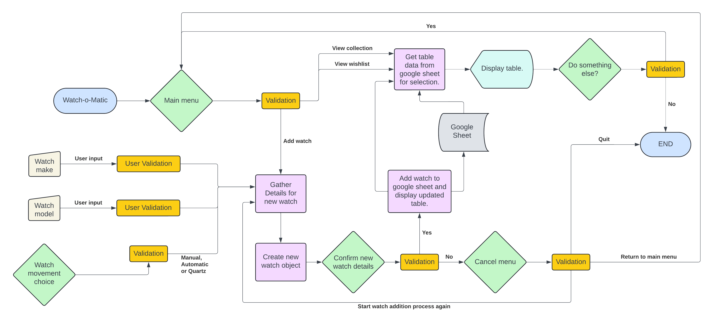

# Watch-o-Matic

[](https://github.com/apeskinian/p3_watch-o-matic/commits/main)
[](https://github.com/apeskinian/p3_watch-o-matic/commits/main)
[](https://github.com/apeskinian/p3_watch-o-matic)

The Watch-o-Matic is a handy tool to keep track of your watch collection. As watch enthusiast's collection is never complete, you can also keep track of your wishlist to plan your future purchases! Each list can be added to when you either treat yourself to a new watch or find one that you want to add to the wishlist. The make, model and movement type of each watch are clearly displayed when either the collection or wishlist is requested.


Source: [Techsini Multi Device Website Mockup Generator](http://techsini.com/multi-mockup/?url=https://apeskinian-watch-o-matic-8cd45839ba26.herokuapp.com/)

## UX

The strategy was to create a tool that can help a watch enthusiast keep track of their watch collection.

The scope of features that I wanted to include were:
- Being able to view the watches owned in a collection.
- Having a wishlist so that the user can keep track of watches that they like / intend to buy.
- Being able to add to either of these lists easily.

As this is a command line based app, it would follow a menu and prompt structure. A main menu will give the user options to choose from the three main features. Then as it goes through each feature more prompts for input as needed will follow.

I used a flowchart to map out the apps logic and proceeded to code it from there to run in the provided terminal.

## User Stories

### New Site Users

- As a new site user, I would like to add all my watches to the app, so that I can see all the watches I own.
- As a new site user, I would like to add a new watch that I've bought to the app, so that I can see that it's in my collection.
- As a new site user, I would like to add a new watch to my wishlist, so that I can see what I want to buy in the future.

### Returning Site Users

- As a returning site user, I would like to view my current watch collection, so that I can keep track of the watches I own.
- As a returning site user, I would like to view my wishlist, so that I can decide whether it's time to buy a new watch.
- As a returning site user, I would like to add a new watch that I've bought to the app, so that I can see that it's in my collection.
- As a returning site user, I would like to add a new watch to my wishlist, so that I can see what I want to buy in the future.

## Features

- ### Main Menu
  This is where the user is greeted and given the options for what they can do in the app. View their current collection, view their wishlist or add a watch to one of the lists. The user is prompted for a choice which is then validated to make sure one of the options was entered and then taken to their choice action.

  

- ### Viewing current collection
  The user is shown their current collection in a table which is ordered alphabetically. This is paginated if the collection has more than 10 watches. Each page is shown as a number out of the total with a prompt to press ENTER to see the next page. When the last page is being shown or there is only one page the option to continue and perform another action is given. If y is entered the user is taked back to the main menu. If n is chosen the app gives a thank you message and ends.

  
  
  

- ### Viewing wishlist
  The user is shown their watch wishlist in a table which is ordered alphabetically. This is paginated if the wishlist has more than 10 watches. Each page is shown as a number out of the total with a prompt to press ENTER to see the next page. When the last page is being shown or there is only one page the option to continue and perform another action is given. If y is entered the user is taked back to the main menu. If n is chosen the app gives a thank you message and ends.

  
  

- ### Adding a watch to either the collection or wishlist
  The user can add a new watch to their collection or their wishlist. They are prompted to choose which option they want which is validated. They can add a watch to their chosen list by entering the required details in the following steps:

  1. User is prompted to enter the make of the watch, this is then double checked with the user who can confirm and move on to the next step or go back and re enter the detail.
  2. User is prompted to enter the model of the watch, this is then double checked with the user who can confirm and move on to the next step or go back and re enter the detail.
  3. User is prompted to choose the movement of the watch from three options:
     - Quartz
     - Manual
     - Automatic
  
     When a valid option is given the user is taken to the next step.
  4. The user is presented with an overview of the watch to be added. They now have two options:
     - Confirm the addition: this will add the watch details to the google sheet and show them the updated collection or wishlist.
     - Cancel the addition: this will them give them the option to start again, go back to the main menu or quit the app.
  
  | Step | Screenshot |
  | --- | --- |
  | Choosing which list to add to: |  |
  | Prompt user for watch make: |  |
  | User confirmation of make: |  |
  | Prompt user for watch model: |  |
  | User confirmation of model: |  |
  | Prompt user for movement choice: |  |
  | Overview of proposed new addition: |  |
  | Confirmation of addition to collection: |  |
  | Confirmation of addition to wishlist: |  |
  | Options given when addition is cancelled: |  |

- ### User input validation

  #### Invalid inputs
  Everytime the user is asked for input it is validated against preset acceptable parameters for each questions. When the app is given an invalid response it will alert the user and show them what they entered highlighted in red. It will then prompt them to try again reminding them of the options that are expected. This will repeat until a valid answer is given.

  | Invalid numeric entry | Invalid alphanumeric entry |
  | --- | --- |
  |  |  |
  |  |  |
  |  |  |
  |  |  |
  |  |  |
  |  |  |
  |  |  |
  |  |  |
  |  |  |

  #### No inputs
  If the user does not input anything and presses enter they are informed this and asked to try again.

  | Non input validation | Non input validation | Non input validation |
  | --- | --- | --- |
  |  |  |  |
  |  |  |  |
  |  |  |  |
  
  #### Self validation
  The only exception to this validation is when entering make and model details for a new watch. As there are virtually endless possibilities for watch makes and names the user is prompted to validate their own input. They have two chances to validate, once when they enter each detail and again before the watch is added.
  
  | User Self Validation for details | User self validation for overview |
  | --- | --- |
  |  |  |

### Future Features

- I would like to add the feature that if you're adding a watch to the collection, it looks to see if it's in the wishlist and if so, asks if the user wants to remove it from the wishlist.
- Being able to move a watch from the wishlist to the collection. This is similar to the above feature but acts on the basis that the user remembers it was in the wishlist so doesn't have to enter the details.
- Being able to remove watches from either list. This would be useful if the user sold a watch and no longer owns it.
- Having user specific collections that can be accessed securely.

## Tools & Technologies Used

- [](https://tim.2bn.dev/markdown-builder) used to generate README and TESTING templates.
- [](https://git-scm.com) used for version control. (`git add`, `git commit`, `git push`)
- [](https://github.com) used for secure online code storage.
- [](https://gitpod.io) used as a cloud-based IDE for development.
- [](https://www.python.org) used as the back-end programming language.
- [](https://www.heroku.com) used for hosting the deployed back-end site.
- [](https://docs.google.com/spreadsheets) used for storing data from my Python app.
- [](https://www.lucidchart.com/pages) used for creating a flowchart for the apps logic.
- [](https://www.mermaidchart.com/) used for creating a flowchart for the apps logic.

## Data Model

### Flowcharts

To follow best practice, a flowchart was created for the app's logic,
and mapped out before coding began using a free version of
[Lucidchart](https://www.lucidchart.com/pages/ER-diagram-symbols-and-meaning)

Below is the flowchart of the main process of this Python program. It shows the entire cycle of the program.



I also made an interactive version of the flowchart using a free version of
[Mermaid](https://www.mermaidchart.com/)

Below is the mermaid flowchart of the main process of this Python program. It shows the entire cycle of the program.


Source in live editor: [Watch-o-Matic Mermaid flowchart](https://mermaid.live/edit#pako:eNqNVmtv2zYU_SsXHDC0gF2IlGVLQtGifmSfsqFN12Cr-oGRaEstRRoS1TQN8t97qYcdeaCwfAp47iHPuS_rkaQ6EyQm8_k8UalW--IQJwrA5KIUMWRizxtp7InU-lsMqeR1XaSJagmJ2kt9n-a8MvBxa6MAFH3xOSG33KT5XM-vucFo8uUlzOdvQPmPCbnmhYJroZqEPPUUH1H4uxYV1EKK1BRadfGLFwn5xGWRcXv2-q56k5CXPSn8jOAfWh-kgJtcCIPQF3jd8lYWEgYMv0MU2Rz2lS4hzXUtFNR9eH_TqnssQtK2qI-SP8DHlqj3sNFyUKQruC3qXBb1M27UcamHzrYaal0KkxfqAELW4u3Z4sJafJdlcG8z05OYlckx1xVm2vBC1rDHV5S478LOz7T0TwUCzwR1Vv8Tcd-LHOPU5t4KMNphyqp1FYIGo0qchVGb6pYxQgeDQ1T4v6JsBdrOgZJ_E11AJ6dQx6Y3RAdHzDuHYxdLV3w4xNNLDzb8mquGywslbGEbVX_HIVAGNrkuUjGRHUYHB0t8YlMJbsS5iqDvvmJ034F2gE7WWYDvbOzYVeXzsg9dQ1kvbDkcBFbD7ajC5_y14GWDnGHPqT9yVJfZ9oY_dX-TTeC74xGuCoUKRH0Z-I-o-zk_pbxt-8bo0i6Cyyy36PsG18fPSyhwafWpQ6tv28E2-Dnx2OqHbkG0Ew9cZZD1E94c8QKRdSviVJAV_I6bZbiRjk15o_MhKz6zNeQqFRL00Wqqn2025vThu3z4XVaKobx0BNwYu23_-o43jlPWwR-EaSplnZd2z2L_NqOS1OYB06Eo7Asp49-urnbemo0gv4c24W65iUbQ4sTaLj1vBIUnaLPdji9c9dB6vd1drUdQ5IawW506cCzcvAn9OCBOA3Q1gYUT2OBhR9e73WqEMW8Co-472WLCw9LtnQVuHosmPEy1w4RO33Nr8Zlbi--P7iQzUooK-zXDL5FHG5mQ9gMkITH-O3yEkEQ9YSjHbXLzoFISm6oRM1Lp5pCTeM_xB3dGurHeFvxQ8fJ0euSKxI_kB4kXlL1a-gENotWKRgs_nJEHEntPM_JTayR4r6LuLwzCpRdQxlr2vy1oH3z6BcdIttk)

### Classes & Functions

The program uses classes as a blueprint for the project's objects (OOP). This allows for the object to be reusable.

```python
class Watch:
    """
    A watch object which is passed when adding a new watch to either the
    current collection or the wishlist.
    """
    def __init__(self, make, model, movement, sheet):
        self.make = make
        self.model = model
        self.movement = movement
        self.sheet = sheet

    def add_to_sheet(self):
        print(f'Adding watch to {self.sheet}...\n')
        worksheet = SHEET.worksheet(self.sheet)
        worksheet.append_row([self.make, self.model, self.movement])
        print(
            f'New watch successfully added to {self.sheet}. '
            f'Loading {self.sheet}...\n'
        )
        view_selection(self.sheet)
```

The class methods used in theis application are:

- `add_to_sheet(self)`
   - Adds the watch object to the google sheet

The primary functions used on this application are:

- `clear()`
    -  Clears the terminal to keep a clean asthetic.
- `validate(user_input, check, request)`
    -  Validates all user inputs.
- `start_over()`
    -  Gives the user options after they have cancelled a watch addition.
- `get_watch_detail(detail, is_movement)`
    -  Gathers details for the creation of a new watch object.
- `add_watch()`
    -  Creates a watch object from the Watch class and adds it to the selected google sheet via the class method.
- `continue_app()`
    -  Checks to see if the user wishes to continue after an action.
- `show_table(table, pages, sheet)`
    -  Displays the requested collection or wishlist in table format.
- `view_selection(sheet_choice)`
    -  Prepares the table to be shown for either the collection or wishlist.
- `get_choice()`
    -  Retrieves the users main menu selection.
- `menu()`
    -  Displays the main menu.
- `main()`
    - Run all program functions.

### Imports

I've used the following Python packages and/or external imported packages.

- `gspread`: used with the Google Sheets API
- `google.oauth2.service_account`: used for the Google Sheets API credentials
- `PrettyTable`: used to create the tables from the google sheets
- `os`: used for adding a `clear()` function
- `time`: used for adding time delays
- `getpass`: used for press ENTER to continue as it does not show any other keys pressed before
- `math`: used to calculate the amount of pages required for the tables

## Testing

> [!NOTE]  
> For all testing, please refer to the [TESTING.md](TESTING.md) file.

## Deployment

Code Institute has provided a [template](https://github.com/Code-Institute-Org/python-essentials-template) to display the terminal view of this backend application in a modern web browser.
This is to improve the accessibility of the project to others.

The live deployed application can be found deployed on [Heroku](https://apeskinian-watch-o-matic-8cd45839ba26.herokuapp.com).

### Heroku Deployment

This project uses [Heroku](https://www.heroku.com), a platform as a service (PaaS) that enables developers to build, run, and operate applications entirely in the cloud.

Deployment steps are as follows, after account setup:

- Select **New** in the top-right corner of your Heroku Dashboard, and select **Create new app** from the dropdown menu.
- Your app name must be unique, and then choose a region closest to you (EU or USA), and finally, select **Create App**.
- From the new app **Settings**, click **Reveal Config Vars**, and set the value of KEY to `PORT`, and the value to `8000` then select *add*.
- If using any confidential credentials, such as CREDS.JSON, then these should be pasted in the Config Variables as well.
- Further down, to support dependencies, select **Add Buildpack**.
- The order of the buildpacks is important, select `Python` first, then `Node.js` second. (if they are not in this order, you can drag them to rearrange them)

Heroku needs three additional files in order to deploy properly.

- requirements.txt
- Procfile
- runtime.txt

You can install this project's **requirements** (where applicable) using:

- `pip3 install -r requirements.txt`

If you have your own packages that have been installed, then the requirements file needs updated using:

- `pip3 freeze --local > requirements.txt`

The **Procfile** can be created with the following command:

- `echo web: node index.js > Procfile`

The **runtime.txt** file needs to know which Python version you're using:
1. type: `python3 --version` in the terminal.
2. in the **runtime.txt** file, add your Python version:
	- `python-3.9.19`

For Heroku deployment, follow these steps to connect your own GitHub repository to the newly created app:

Either:

- Select **Automatic Deployment** from the Heroku app.

Or:

- In the Terminal/CLI, connect to Heroku using this command: `heroku login -i`
- Set the remote for Heroku: `heroku git:remote -a app_name` (replace *app_name* with your app name)
- After performing the standard Git `add`, `commit`, and `push` to GitHub, you can now type:
	- `git push heroku main`

The frontend terminal should now be connected and deployed to Heroku!

### Google Sheet and Google API requirements

To run your own version of this app you will need to create your own google sheet with two sheets named "collection" and "wishlist" in the following format:

| Make | Model | Movement |
| --- | --- | --- |
| sample data | sample data | Manual |
| sample data | sample data | Automatic |
| sample data | sample data | Manual |
| sample data | sample data | Quartz |

A credentials file in JSON format from the Google Cloud Platform is also needed steps to obtain one are below:

[Google Cloud Platform](https://console.cloud.google.com/)

1. From the dashboard click on 'Select a project' and then the 'NEW PROJECT' button
2. Give the project a name and then click 'CREATE'
3. Click 'SELECT PROJECT' to get to the project page
4. From the side menu select 'APIs & Services' then select 'Library'
5. Search for the 'Google Drive API', select it and then click on 'ENABLE'
6. Click on the 'CREATE CREDENTIALS' button
7. From the 'Which API are you using?' dropdown menu, choose Google Drive API
8. For the 'What data will you be accessing?' question, select Application Data
9. Click Next
10. Enter a Service Account name then click Create
11. In the Role Dropdown box choose Basic > Editor then press Continue
12. 'Grant users access to this service account' can be left blank. Click 'DONE'
13. On the next page, click on the Service Account that has been created
14. On the next page, click on the Keys tab
15. Click on the Add Key dropdown and select Create New Key
16. Select JSON and then click Create. This will trigger the json file with your API credentials in it to download to your machine
17. For local deployment this needs to be renamed to creds.json
18. Repeat steps 4 & 5 to add the 'Google Sheets API'
19. Copy the client_email that is in the creds.json file
20. Share your google sheet to the client_email ensuring editing is enabled
21. Add the creds.json file to the .gitignore list so as not to push your credentials


### Local Deployment

This project can be cloned or forked in order to make a local copy on your own system.

For either method, you will need to install any applicable packages found within the *requirements.txt* file.

- `pip3 install -r requirements.txt`.

If using any confidential credentials, such as `CREDS.json` or `env.py` data, these will need to be manually added to your own newly created project as well.

#### Cloning

You can clone the repository by following these steps:

1. Go to the [GitHub repository](https://github.com/apeskinian/p3_watch-o-matic) 
2. Locate the Code button above the list of files and click it 
3. Select if you prefer to clone using HTTPS, SSH, or GitHub CLI and click the copy button to copy the URL to your clipboard
4. Open Git Bash or Terminal
5. Change the current working directory to the one where you want the cloned directory
6. In your IDE Terminal, type the following command to clone my repository:
	- `git clone https://github.com/apeskinian/p3_watch-o-matic.git`
7. Press Enter to create your local clone.

Alternatively, if using Gitpod, you can click below to create your own workspace using this repository.

[](https://gitpod.io/#https://github.com/apeskinian/p3_watch-o-matic)

Please note that in order to directly open the project in Gitpod, you need to have the browser extension installed.
A tutorial on how to do that can be found [here](https://www.gitpod.io/docs/configure/user-settings/browser-extension).

#### Forking

By forking the GitHub Repository, we make a copy of the original repository on our GitHub account to view and/or make changes without affecting the original owner's repository.
You can fork this repository by using the following steps:

1. Log in to GitHub and locate the [GitHub Repository](https://github.com/apeskinian/p3_watch-o-matic)
2. At the top of the Repository (not top of page) just above the "Settings" Button on the menu, locate the "Fork" Button.
3. Once clicked, you should now have a copy of the original repository in your own GitHub account!

### Local VS Deployment

There are no differences between the local and deployed version of the site.

## Credits

### Content

| Source | Location | Notes |
| --- | --- | --- |
| [Markdown Builder](https://tim.2bn.dev/markdown-builder) | README and TESTING | tool to help generate the Markdown files |
| [PrettyTable PyPI](https://pypi.org/project/prettytable/) | Python Code | Displaying data in a neat table |
| [Python match/case](https://stackoverflow.com/questions/11479816/what-is-the-python-equivalent-for-a-case-switch-statement) | Python Code | Using match/case in Python |
| [Colouring Text in terminal](https://gist.github.com/kamito/704813) | PP3 Terminal | Using colour codes to style the text in the terminal |
| [Mermaid Chart](https://www.mermaidchart.com/) | README | Flowchart creation |

### Media

| Source | Location | Type | Notes |
| --- | --- | --- | --- |
| [TinyPNG](https://tinypng.com) | Documentation | Images | Tool for image compression |
| [Adobe Express](https://www.adobe.com/express/feature/video/convert/mov-to-gif) | TESTING | Image | Tool for mov to gif conversion |

### Acknowledgements

- I would like to thank my Code Institute mentor, [Tim Nelson](https://github.com/TravelTimN) for his support throughout the development of this project.
- I would like to thank the [Code Institute](https://codeinstitute.net) tutor team for their assistance with troubleshooting and debugging some project issues.
- I would like to thank the [Code Institute Slack community](https://code-institute-room.slack.com) for the moral support; it kept me going during periods of self doubt and imposter syndrome.
- I would like to thank my daughter Niamh, my sisters Laura & Natalie and my whole family for believing in me, and supporting me while making this transition into software development.