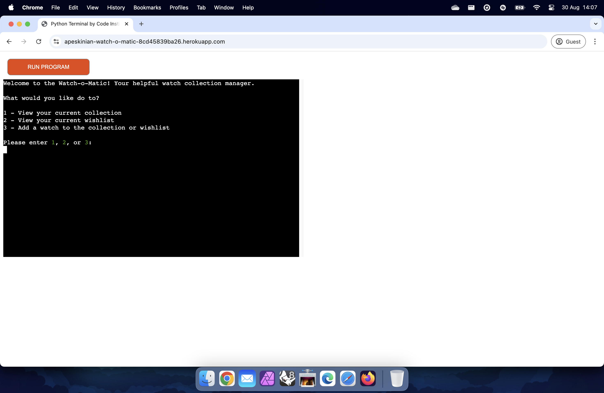
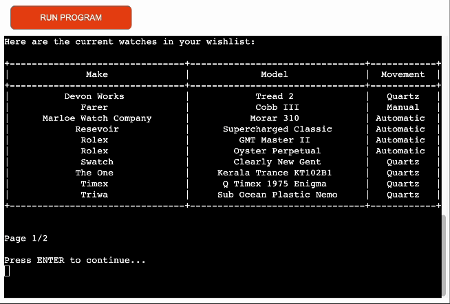

# Testing

> [!NOTE]  
> Return back to the [README.md](README.md) file.

## Code Validation

### Python

I have used the recommended [PEP8 CI Python Linter](https://pep8ci.herokuapp.com) to validate all of my Python files.

| File | CI URL | Screenshot | Notes |
| --- | --- | --- | --- |
| run.py | [PEP8 CI](https://pep8ci.herokuapp.com/https://raw.githubusercontent.com/apeskinian/p3_watch-o-matic/main/run.py) |  | |

## Browser Compatibility

| Browser | Home | Notes |
| --- | --- | --- |
| Chrome |  | Works as expected |
| Firefox |  | Works as expected |
| Edge |  | Works as expected |
| Safari |  | Works as expected |

## Responsiveness

I've tested my deployed project on multiple devices to check for responsiveness issues.

| Device | Home | Notes |
| --- | --- | --- |
| Mobile (DevTools) |  | Works as expected |
| Tablet (DevTools) |  | Works as expected |
| 4K Monitor (DevTools)|  | Noticeable scaling issues |
| iPhone 15 Pro |  | Does not resize to fit width and keyboard does not input |
| iPad Mini |  | Does not resize to fit width and keyboard does not input |
| MacBook Air M3 |  | Works as expected |
| 2K Desktop Monitor |  | Works as expected |

## Lighthouse Audit

I've tested my deployed project using the Lighthouse Audit tool to check for any major issues.

| Page | Mobile | Desktop | Notes |
| --- | --- | --- | --- |
| Main |  |  | Some minor warnings |

## Defensive Programming

| Page | Test | Expectation | Result | Screenshot |
| --- | --- | --- | --- | --- |
| Main Menu |  |  |  |  |
|  | Testing valid input of 1 | User should be shown the current collection | Test successful |  |
|  | Testing valid input of 2 | User should be shown the wishlist | Test successful |  |
|  | Testing valid input of 3 | The process of adding a watch should start | Test successful |  |
|  | Testing invalid numeric inputs | Validation should fail and user be informed that they entered an invalid input showing them what was entered. They should be reminded of the accepted inputs and prompted to try again | Test successful |  |
|  | Testing invalid alphanumeric inputs | Validation should fail and user be informed that they entered an invalid input showing them what was entered. They should be reminded of the accepted inputs and prompted to try again | Test successful |  |
|  | Testing no input and just pressing the ENTER key | Validation should fail and user be informed that no input was entered. They should be reminded of the accepted inputs and prompted to try again | Test successful |  |
|  | Testing multiple invalid inputs | Validation should continue to fail for each invalid input giving the correct response until a valid input is entered at which point the app should proceed to the relevant point | Test successful |  |
| View Collection |  |  |  |  |  |
|  | Testing valid input of ENTER for pagination | User should be shown the next page of the list | Test successful |  |
|  | Testing invalid inputs for pagination prompt | The app should not show any inputs, effectively ignoring everything until ENTER is pressed | Test successful |  |
|  | Testing valid input of y for y/n prompt | User should be shown the main menu | Test successful (capital Y also accepted) |  |
|  | Testing valid input of n for y/n prompt | User should be shown the app exit message and app ends | Test successful (capital N also accepted) |  |
|  | Testing invalid numeric inputs for y/n prompt | Validation should fail and user be informed that they entered an invalid input showing them what was entered. They should be reminded of the accepted inputs and prompted to try again | Test successful |  |
|  | Testing invalid alphanumeric inputs for y/n prompt | Validation should fail and user be informed that they entered an invalid input showing them what was entered. They should be reminded of the accepted inputs and prompted to try again | Test successful |  |
|  | Testing no input and just pressing the ENTER key for y/n prompt | Validation should fail and user be informed that no input was entered. They should be reminded of the accepted inputs and prompted to try again | Test successful |  |
|  | Testing multiple invalid inputs for y/n prompt  | Validation should continue to fail for each invalid input giving the correct response until a valid input is entered at which point the app should proceed to the relevant point | Test successful |  |
| View Wishlist |  |  |  |  |  |
|  | Testing valid input of ENTER for pagination | User should be shown the next page of the list | Test successful |  |
|  | Testing invalid inputs for pagination prompt | The app should not show any inputs, effectively ignoring everything until ENTER is pressed | Test successful |  |
|  | Testing valid input of y for y/n prompt | User should be shown the main menu | Test successful (capital Y also accepted) |  |
|  | Testing valid input of n for y/n prompt | User should be shown the app exit message and app ends | Test successful (capital N also accepted) |  |
|  | Testing invalid numeric inputs for y/n prompt  | Validation should fail and user be informed that they entered an invalid input showing them what was entered. They should be reminded of the accepted inputs and prompted to try again | Test successful |  |
|  | Testing invalid alphanumeric inputs for y/n prompt  | Validation should fail and user be informed that they entered an invalid input showing them what was entered. They should be reminded of the accepted inputs and prompted to try again | Test successful |  |
|  | Testing no input and just pressing the ENTER key for y/n prompt | Validation should fail and user be informed that no input was entered. They should be reminded of the accepted inputs and prompted to try again | Test successful |  |
|  | Testing multiple invalid inputs for y/n prompt  | Validation should continue to fail for each invalid input giving the correct response until a valid input is entered at which point the app should proceed to the relevant point | Test successful |  |
| Add watch - List selection |  |  |  |  |  |
|  | Testing valid input of 1 | User should be taken to the input screen for Watch make with a confirmation message adding to collection | Test successful |  |
|  | Testing valid input of 2 | User should be taken to the input screen for Watch make with a confirmation message adding to Wishlist | Test successful |  |
|  | Testing invalid numeric inputs | Validation should fail and user be informed that they entered an invalid input showing them what was entered. They should be reminded of the accepted inputs and prompted to try again | Test successful |  |
|  | Testing invalid alphanumeric inputs | Validation should fail and user be informed that they entered an invalid input showing them what was entered. They should be reminded of the accepted inputs and prompted to try again | Test successful |  |
|  | Testing no input and just pressing the ENTER | Validation should fail and user be informed that no input was entered. They should be reminded of the accepted inputs and prompted to try again | Test successful |  |
|  | Testing multiple invalid inputs | Validation should continue to fail for each invalid input giving the correct response until a valid input is entered at which point the app should proceed to the relevant point | Test successful |  |
| Add watch -  User input confirmation for watch make |  |  |  |  |  |
|  | Testing user input | User should be prompted to validate their input with y/n response | Test successful |  |
|  | Testing no input and pressing ENTER | User should be made aware that no input was given and prompted to validate this input with y/n response | Test successful |  |
| Add watch -  User input validation for watch make |  |  |  |  |  |
|  | Testing valid input of y | User should be taken to the watch model input | Test successful (capital Y also accepted) |  |
|  | Testing valid input of n | User should be prompted to re enter the watch make | Test successful (capital N also accepted) |  |
|  | Testing invalid numeric inputs | Validation should fail and user be informed that they entered an invalid input showing them what was entered. They should be reminded of the accepted inputs and prompted to try again | Test successful |  |
|  | Testing invalid alphanumeric inputs | Validation should fail and user be informed that they entered an invalid input showing them what was entered. They should be reminded of the accepted inputs and prompted to try again | Test successful |  |
|  | Testing no input and just pressing the ENTER key | Validation should fail and user be informed that no input was entered. They should be reminded of the accepted inputs and prompted to try again | Test successful |  |
|  | Testing multiple invalid inputs | Validation should continue to fail for each invalid input giving the correct response until a valid input is entered at which point the app should proceed to the relevant point | Test successful |  |
| Add watch -  User input confirmation for watch model |  |  |  |  |  |
|  | Testing user input | User should be prompted to validate their input with y/n response | Test successful |  |
|  | Testing no input and pressing ENTER | User should be made aware that no input was given and prompted to validate this input with y/n response | Test successful |  |
| Add watch -  User input validation for watch model |  |  |  |  |  |
|  | Testing valid input of y | User should be taken to the watch movement input | Test successful (capital Y also accepted) |  |
|  | Testing valid input of n | User should be prompted to re enter the watch model | Test successful (capital N also accepted) |  |
|  | Testing invalid numeric inputs | Validation should fail and user be informed that they entered an invalid input showing them what was entered. They should be reminded of the accepted inputs and prompted to try again | Test successful |  |
|  | Testing invalid alphanumeric inputs | Validation should fail and user be informed that they entered an invalid input showing them what was entered. They should be reminded of the accepted inputs and prompted to try again | Test successful |  |
|  | Testing no input and just pressing the ENTER key | Validation should fail and user be informed that no input was entered. They should be reminded of the accepted inputs and prompted to try again | Test successful |  |
|  | Testing multiple invalid inputs | Validation should continue to fail for each invalid input giving the correct response until a valid input is entered at which point the app should proceed to the relevant point | Test successful |  |
| Add watch -  Movement selection |  |  |  |  |  |
|  | Testing valid input of 1 | User should be taken to the watch addition overview with Quartz as the selected movement | Test successful |  |
|  | Testing valid input of 2 | User should be taken to the watch addition overview with Manual as the selected movement | Test successful |  |
|  | Testing valid input of 3 | User should be taken to the watch addition overview with Automatic as the selected movement | Test successful |  |
|  | Testing invalid numeric inputs | Validation should fail and user be informed that they entered an invalid input showing them what was entered. They should be reminded of the accepted inputs and prompted to try again | Test successful |  |
|  | Testing invalid alphanumeric inputs | Validation should fail and user be informed that they entered an invalid input showing them what was entered. They should be reminded of the accepted inputs and prompted to try again | Test successful |  |
|  | Testing no input and just pressing the ENTER key | Validation should fail and user be informed that no input was entered. They should be reminded of the accepted inputs and prompted to try again | Test successful |  |
|  | Testing multiple invalid inputs | Validation should continue to fail for each invalid input giving the correct response until a valid input is entered at which point the app should proceed to the relevant point | Test successful |  |
| Add watch -  New watch details overview |  |  |  |  |  |
|  | Testing valid input of y | Watch should be added to the google sheet and user informed of success before being shown the updated table | Test successful (capital Y also accepted) |  |
|  | Testing valid input of n | User should be given the menu for watch addition cancellation, google sheet should not be updated | Test successful (capital N also accepted) |  |
|  | Testing invalid numeric inputs | Validation should fail and user be informed that they entered an invalid input showing them what was entered. They should be reminded of the accepted inputs and prompted to try again | Test successful |  |
|  | Testing invalid alphanumeric inputs | Validation should fail and user be informed that they entered an invalid input showing them what was entered. They should be reminded of the accepted inputs and prompted to try again | Test successful |  |
|  | Testing no input and just pressing the ENTER key | Validation should fail and user be informed that no input was entered. They should be reminded of the accepted inputs and prompted to try again | Test successful |  |
|  | Testing multiple invalid inputs | Validation should continue to fail for each invalid input giving the correct response until a valid input is entered at which point the app should proceed to the relevant point | Test successful |  |
| Watch addition cancelled |  |  |  |  |  |
|  | Testing valid input of 1 | User should be taken to the beginning of the add watch section | Test successful |  |
|  | Testing valid input of 2 | User should be taken to the main menu | Test successful |  |
|  | Testing valid input of 3 | User should be shown the app exit message and app ends | Test successful |  |
|  | Testing invalid numeric inputs | Validation should fail and user be informed that they entered an invalid input showing them what was entered. They should be reminded of the accepted inputs and prompted to try again | Test successful |  |
|  | Testing invalid alphanumeric inputs | Validation should fail and user be informed that they entered an invalid input showing them what was entered. They should be reminded of the accepted inputs and prompted to try again | Test successful |  |
|  | Testing no input and just pressing the ENTER key | Validation should fail and user be informed that no input was entered. They should be reminded of the accepted inputs and prompted to try again | Test successful |  |
|  | Testing multiple invalid inputs | Validation should continue to fail for each invalid input giving the correct response until a valid input is entered at which point the app should proceed to the relevant point | Test successful |  |

## User Story Testing

| User Story | Screenshot |
| --- | --- |
| As a new site user, I would like to add all my watches to the app, so that I can see all the watches I own. |  |
| As a new site user, I would like to add a new watch that I've bought to the app, so that I can see that it's in my collection. |  |
| As a new site user, I would like to add a new watch to my wishlist, so that I can see what I want to buy in the future. |  |
| As a returning site user, I would like to view my current watch collection, so that I can keep track of the watches I own. |  |
| As a returning site user, I would like to view my wishlist, so that I can decide whether it's time to buy a new watch. |  |
| As a returning site user, I would like to add a new watch that I've bought to the app, so that I can see that it's in my collection. |  |
| As a returning site user, I would like to add a new watch to my wishlist, so that I can see what I want to buy in the future. |  |

## Bugs

| Decription | Bug | Solution | Result |
| --- | --- | --- | --- |
| The PrettyTable was showing some odd behaviour when the content width was larger than the deployment terminal. To fix this, I added the max-width parameters to the table so that if the content was longer the table would start to wrap text to the rwo below and stop the strange display behaviour. |  |  |  |

## Unfixed Bugs

> [!NOTE]  
> There are no remaining bugs that I am aware of.
